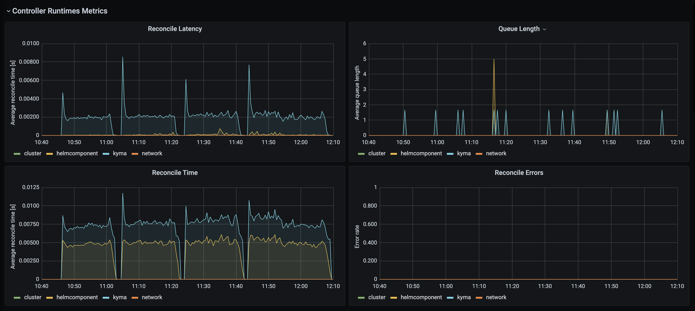
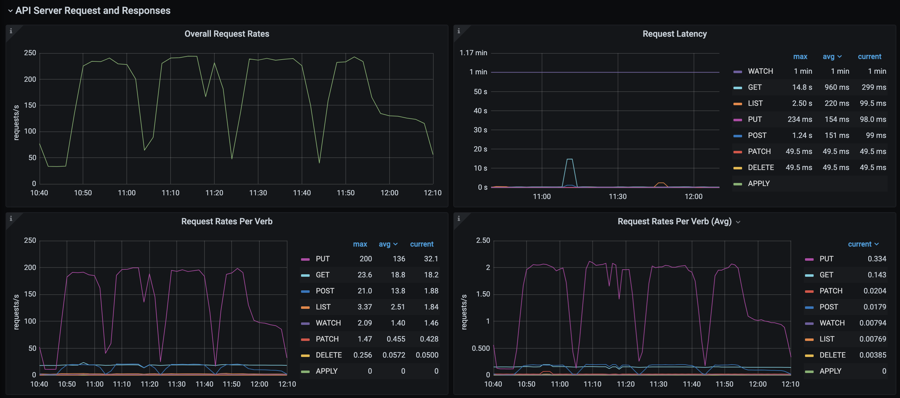
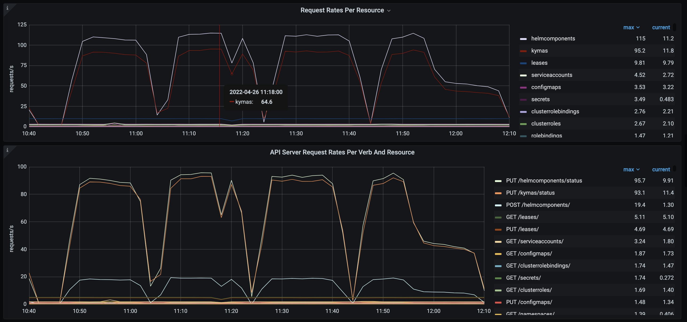
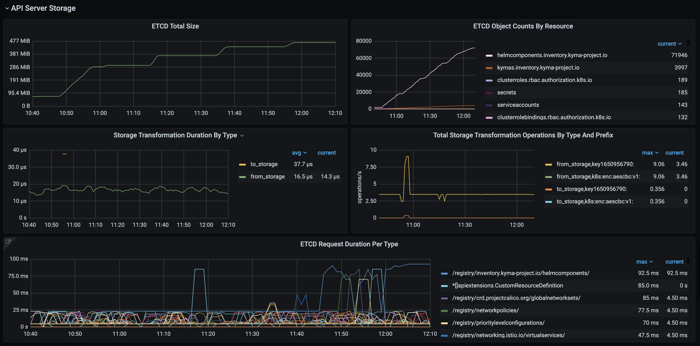
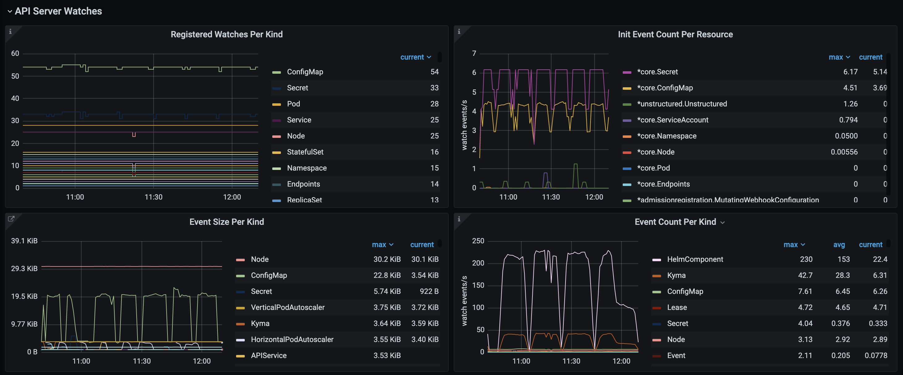

# Project setup

The project was created with [kubebuilder](https://github.com/kubernetes-sigs/kubebuilder):

```
kubebuilder init --domain kyma-project.io --repo github.com/kyma-incubator/kymactl
kubebuilder create api --group inventory --version v1alpha1 --kind Cluster
kubebuilder create api --group inventory --version v1alpha1 --kind HelmComponent
kubebuilder create api --group inventory --version v1alpha1 --kind Kyma
```

# Testing

## Locally

Start controller:
```
make manifests
make install 
make run
```

## In the cluster

You need a write access to some docker registry. You can use github (ghcr.io). Just create personal access token (developer settings) and use it as a password to login:
```
docker login ghcr.io -u your_github_user 
```
Build and push controller:
```
make docker-build docker-push IMG=ghcr.io/pbochynski/kyma-operator:0.0.6
```

Run controller:
```
make install 
make deploy IMG=ghcr.io/pbochynski/kyma-operator:0.0.6
```

## Generate sample data

```
kubectl create ns pb
./config/samples/sample-data.sh
```

# Performance test

Basic scenario:

1. Create Kyma CR with list of modules
2. Kyma controller creates HelmComponent CR for each module
3. HelmComponent controller simulates installation lifecycle: `pending -> started -> failing -> retrying  -> success`. The transition to the next state takes N seconds where N=len(component name). The reconciliation of all components for single Kyma takes about 68 seconds.

The goal is to prove that Kyma operator can reconcile thousands of clusters in parallel without issues related to kubernetes API server and its storage (etcd). The simplest possible test is just to generate 1000 or more Kyma CR using [sample-data.sh](./config/samples/sample-data.sh) script and check how long it will take to bring all helm components (18 * 1000 = 18000) to the status `success`. 
Kubernetes API Server will not allow to create all these resources at once due to built-in rate limiting. Usually it is not a problem, as it is not expected that large number of Kyma installations will be started at the same time. Nevertheless, we should try to find the settings that allow to process thousands clusters in the time that is comparable to the time that is required to reconcile single component.

Controllers publish metrics and reconciliation queue length can be observed using metrics endpoint directly when controller runs locally (`curl http://localhost:8080/metrics`). In the cluster you can use Kyma monitoring components (prometheus and grafana) to see controller metrics.

## Results
In the experiment 4000 Kyma objects where created in 4 batches with 1000 each, what gives 72000 HelmComponent objects created.
Objects where created in the sequence using [simple bash script](./config/samples/sample-data.sh)

Observations:
- Script was running with the rate 1.1. object per second up to 4th batch. In the last batch kubectl commands where significantly slower
- Reconciliation queue was not growing - all the objects were created immediately and transition to the next state was done in the timely manner
- The memory allocation for controller grows with the number of CRs. With empty cluster controller takes about 40MB, and grows to 350MB for 76000 watched objects.









# Findings
## Kubernetes client rate limiting

Default kubernetes client is configured with QPS=20 and Burst=30. For the scenario where 1 Kyma resource creates 18 modules we can create/update at most une Kyma installation per second. More reasonable setting would be:

```
cfg.QPS = 150
cfg.Burst = 150
```

This is inspired by prometheus operator settings:
https://github.com/prometheus-operator/prometheus-operator/blob/bbf82e22de6fa2bf3f28cecdc82a8695748d5017/pkg/k8sutil/k8sutil.go#L96-L97

See also: https://github.com/voyagermesh/voyager/issues/640

## Reconciliation queue rate limiting

The default rate limiting was changed to allow more reconciliations (bigger bucket) and increase the time of first retry from 5ms to 1s:

```
func CustomRateLimiter() ratelimiter.RateLimiter {
	return workqueue.NewMaxOfRateLimiter(
		workqueue.NewItemExponentialFailureRateLimiter(1*time.Second, 1000*time.Second),
		&workqueue.BucketRateLimiter{Limiter: rate.NewLimiter(rate.Limit(30), 200)})
}
```
Good explanation of rate limits in controllers: [https://danielmangum.com/posts/controller-runtime-client-go-rate-limiting/?utm_source=pocket_mylist](https://danielmangum.com/posts/controller-runtime-client-go-rate-limiting/?utm_source=pocket_mylist)

## Time based reconciliation

Time based reconciliation has default interval of 10 hours. It is not recommended to change it unless you know what you are doing. But in our case it can be a good option to force reconciliation more frequently. We need just to ensure that reconciliation will not overload controller with massive amount of objects to reconcile. You can simulate what will happen when time based reconciliation is triggered by restarting your controller when a large number of objects exist in the cluster. Ensure you can process them all in reasonable time and with reasonable resources (tests it!).
## Modify objects only if you need

Each modification even without changes triggers other controllers that watch the resource. It is true also for status subresource. It is a good practice to modify the object only when it is needed. Additionally, you can opt out from updates that do not change the object generation (e.g. status update) using event filter when you create a controller:
```
		WithEventFilter(predicate.GenerationChangedPredicate{}).
```
